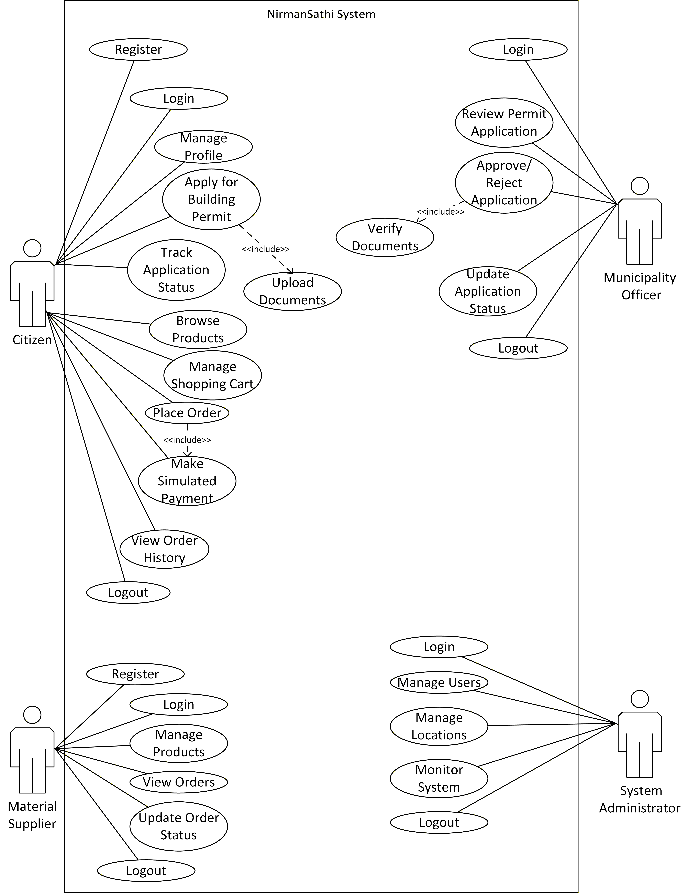

# Software Requirements Specification (SRS)

# NirmanSathi

## An Integrated Residential Construction Governance & Marketplace Platform for Nepal

---

## Submitted By

- **Binit Kumar Singh**
- **Alkesh Chaudhary**
- **Prine Upadhaya**

**Program:** Bachelor of Computer Science and Information Technology (BCS CSIT)

**Semester:** Sixth Semester

---

## Submitted To

**Department of Computer Science**

**Orchid International College**

---

## Course

**E-Governance**

---

# Document Information

| Field            | Details                                                            |
| ---------------- | ------------------------------------------------------------------ |
| Document Title   | Software Requirements Specification (SRS)                          |
| Project Name     | NirmanSathi                                                        |
| Version          | 1.0                                                                |
| Document Status  | Draft                                                              |
| Course           | E-Governance                                                       |
| Academic Program | Bachelor of Computer Science and Information Technology (BCS CSIT) |
| Institution      | Orchid International College                                       |
| Authors          | Binit Kumar Singh, Alkesh Chaudhary, Prine Upadhaya                |
| Prepared On      | July 2026                                                          |

# Version History

| Version | Date      | Description                                 | Author(s)                                           |
| ------- | --------- | ------------------------------------------- | --------------------------------------------------- |
| 1.0     | July 2026 | Initial Software Requirements Specification | Binit Kumar Singh, Alkesh Chaudhary, Prine Upadhaya |

# Table of Contents

1. Introduction
   - Purpose
   - Scope
   - Definitions, Acronyms and Abbreviations
   - References
   - Document Overview

2. Overall Description
   - Product Perspective
   - Product Functions
   - User Classes and Characteristics
   - Operating Environment
   - Design Constraints
   - Assumptions and Dependencies

3. Functional Requirements
   - FR-01 User Authentication
   - FR-02 User Management
   - FR-03 Location Management
   - FR-04 Building Permit Application
   - FR-05 Document Upload
   - FR-06 Permit Approval Workflow
   - FR-07 Application Status Tracking
   - FR-08 Product Management
   - FR-09 Shopping Cart
   - FR-10 Simulated eSewa Payment
   - FR-11 Order Management

4. Non-Functional Requirements
   - Performance
   - Security
   - Reliability
   - Usability
   - Availability
   - Maintainability

5. System Models
   - Use Case Diagram
   - Activity Diagram
   - Sequence Diagram
   - Class Diagram
   - ER Diagram

6. Appendices

# 1. Introduction

## 1.1 Purpose

The purpose of this Software Requirements Specification (SRS) is to define the functional and non-functional requirements of **NirmanSathi**, an integrated residential construction governance and marketplace platform for Nepal.

This document serves as the primary reference for the analysis, design, development, testing, and maintenance of the system. It provides a clear understanding of the system requirements for developers, project supervisors, and stakeholders involved in the project.

The SRS also establishes a common understanding of the project's scope and ensures that all development activities remain consistent with the approved project proposal and feasibility study.

## 1.2 Scope

NirmanSathi is a web-based platform that integrates residential construction governance services with a construction material marketplace.

The current implementation focuses on digitizing the building permit application process while providing an online marketplace for construction materials. Citizens can submit building permit applications, upload supporting documents, track application status, and purchase construction materials through a simulated eSewa payment workflow.

The project includes the following major modules:

- User Authentication
- Role-Based Access Control
- Citizen Registration
- Province, District, Municipality and Ward Management
- Building Permit Management
- Document Upload
- Permit Approval Workflow
- Application Status Tracking
- Construction Material Marketplace
- Shopping Cart
- Simulated eSewa Payment
- Order History

Future versions of NirmanSathi may include architect and contractor marketplaces, equipment rental services, GIS integration, AI-assisted blueprint validation, and official digital payment gateway integration.

## 1.3 Definitions, Acronyms and Abbreviations

| Term                 | Description                                                      |
| -------------------- | ---------------------------------------------------------------- |
| SRS                  | Software Requirements Specification                              |
| RBAC                 | Role-Based Access Control                                        |
| Admin                | System Administrator                                             |
| Citizen              | Registered user applying for construction permits                |
| Municipality Officer | Government officer responsible for reviewing permit applications |
| Material Supplier    | Registered seller of construction materials                      |
| PostgreSQL           | Relational database management system used by the project        |
| Django               | Python web framework used for backend development                |
| Bootstrap            | Frontend CSS framework                                           |
| eSewa                | Simulated online payment gateway used for demonstration purposes |

## 1.4 References

The following documents and resources were referred to during the preparation of this Software Requirements Specification.

- Project Proposal – NirmanSathi
- Feasibility Study – NirmanSathi
- Django Documentation: <https://docs.djangoproject.com/>
- PostgreSQL Documentation: <https://www.postgresql.org/docs/>
- Bootstrap Documentation: <https://getbootstrap.com/docs/>
- IEEE Recommended Practice for Software Requirements Specifications (IEEE 830)

## 1.5 Document Overview

This Software Requirements Specification is organized into six chapters.

Chapter 1 introduces the purpose, scope, terminology, references, and organization of the document.

Chapter 2 provides an overview of the system, including its functions, users, operating environment, design constraints, and assumptions.

Chapter 3 specifies the functional requirements of the e-governance and marketplace modules.

Chapter 4 describes the non-functional requirements such as security, performance, reliability, usability, and maintainability.

Chapter 5 presents the system models, including UML diagrams and database design that support system implementation.

Chapter 6 contains appendices and supporting information related to the project.

# 2. Overall Description

## 2.1 Product Perspective

NirmanSathi is a web-based application developed to integrate residential construction governance services with a construction material marketplace. It provides a single platform where citizens can apply for building permits while also purchasing construction materials online.

The system is designed using a modular architecture, allowing future expansion without affecting the existing modules. The current implementation focuses on building permit management and a construction material marketplace to satisfy the requirements of the E-Governance course.

2.2 Product Functions

The major functions provided by the system are:

### E-Governance Module

- User Registration and Login
- Role-Based Access Control
- Citizen Profile Management
- Province, District, Municipality and Ward Management
- Building Permit Application
- Supporting Document Upload
- Permit Review and Approval
- Application Status Tracking

### Marketplace Module

- Product Category Management
- Construction Material Management
- Shopping Cart
- Simulated eSewa Payment
- Order Management
- Order History

## 2.3 User Classes and Characteristics

The system consists of four primary user roles.

| User                 | Responsibilities                                                                                                                                                           |
| -------------------- | -------------------------------------------------------------------------------------------------------------------------------------------------------------------------- |
| Citizen              | Register an account, submit building permit applications, upload documents, track application status, browse construction materials, place orders, and view order history. |
| Municipality Officer | Review permit applications, verify submitted documents, approve or reject applications, and update application status.                                                     |
| Material Supplier    | Manage construction material listings, update product information, and process customer orders.                                                                            |
| System Administrator | Manage users, locations, system configuration, and monitor overall system operations.                                                                                      |

## 2.4 Operating Environment

The system will operate in the following environment.

| Component        | Technology                                     |
| ---------------- | ---------------------------------------------- |
| Operating System | Windows 10/11                                  |
| Backend          | Django (Python 3.x)                            |
| Frontend         | HTML, CSS, Bootstrap, JavaScript               |
| Database         | PostgreSQL                                     |
| Browser          | Google Chrome, Microsoft Edge, Mozilla Firefox |
| Version Control  | Git and GitHub                                 |

## 2.5 Design Constraints

The development of NirmanSathi is subject to the following constraints:

- The project must be completed within the academic semester.
- The system will be developed using Django as the backend framework.
- PostgreSQL will be used as the database management system.
- A simulated eSewa payment workflow will be implemented instead of real payment gateway integration.
- The project focuses only on residential building permit management and a construction material marketplace.
- Advanced features such as GIS integration, AI-assisted blueprint validation, mobile applications, and real payment gateway integration are outside the scope of the current implementation.

## 2.6 Assumptions and Dependencies

The development of NirmanSathi is based on the following assumptions and dependencies:

- Users have access to a stable internet connection.
- Municipality officers will verify applications through the system.
- Citizens will provide accurate information and valid supporting documents.
- Product information entered by material suppliers is assumed to be accurate.
- The system depends on Django, PostgreSQL, Bootstrap, and GitHub for development and deployment.
- The simulated eSewa payment process is intended for demonstration purposes only and does not perform real financial transactions.

# 3. Functional Requirements

## FR-01 User Authentication

| Field          | Description                                                                     |
| -------------- | ------------------------------------------------------------------------------- |
| Requirement ID | FR-01                                                                           |
| Module         | E-Governance                                                                    |
| Description    | The system shall allow users to register, log in, and log out securely.         |
| Actors         | Citizen, Municipality Officer, Material Supplier, System Administrator          |
| Preconditions  | User must have a registered account.                                            |
| Postconditions | User is successfully authenticated and redirected to the appropriate dashboard. |
| Inputs         | Email, Password                                                                 |
| Outputs        | Login success message or error message                                          |
| Business Rules | Email must be unique. Passwords shall be stored in encrypted form.              |

## FR-02 User Management

| Field          | Description                                                              |
| -------------- | ------------------------------------------------------------------------ |
| Requirement ID | FR-02                                                                    |
| Module         | E-Governance                                                             |
| Description    | The system shall manage user profiles and assign role-based permissions. |
| Actors         | System Administrator                                                     |
| Preconditions  | User account exists.                                                     |
| Postconditions | User information or role is updated successfully.                        |
| Inputs         | User details, Role                                                       |
| Outputs        | Updated user profile                                                     |
| Business Rules | Each user shall have only one assigned role.                             |

## FR-03 Location Management

| Field          | Description                                                                     |
| -------------- | ------------------------------------------------------------------------------- |
| Requirement ID | FR-03                                                                           |
| Module         | E-Governance                                                                    |
| Description    | The system shall manage Province, District, Municipality, and Ward information. |
| Actors         | System Administrator                                                            |
| Preconditions  | Administrator is logged in.                                                     |
| Postconditions | Location information is added, updated, or removed successfully.                |
| Inputs         | Province, District, Municipality, Ward                                          |
| Outputs        | Updated location records                                                        |
| Business Rules | Every ward must belong to one municipality.                                     |

## FR-04 Building Permit Application

| Field          | Description                                                            |
| -------------- | ---------------------------------------------------------------------- |
| Requirement ID | FR-04                                                                  |
| Module         | E-Governance                                                           |
| Description    | Citizens shall be able to submit building permit applications online.  |
| Actors         | Citizen                                                                |
| Preconditions  | Citizen is logged in.                                                  |
| Postconditions | Permit application is submitted successfully.                          |
| Inputs         | Applicant details, Building information, Uploaded documents            |
| Outputs        | Application reference number                                           |
| Business Rules | Required information and documents must be provided before submission. |

## FR-05 Document Upload

| Field          | Description                                                                             |
| -------------- | --------------------------------------------------------------------------------------- |
| Requirement ID | FR-05                                                                                   |
| Module         | E-Governance                                                                            |
| Description    | The system shall allow citizens to upload supporting documents for permit applications. |
| Actors         | Citizen                                                                                 |
| Preconditions  | Building permit application exists.                                                     |
| Postconditions | Documents are stored successfully.                                                      |
| Inputs         | PDF or image files                                                                      |
| Outputs        | Upload confirmation                                                                     |
| Business Rules | Only supported file formats shall be accepted.                                          |

## FR-06 Permit Approval Workflow

| Field          | Description                                                                          |
| -------------- | ------------------------------------------------------------------------------------ |
| Requirement ID | FR-06                                                                                |
| Module         | E-Governance                                                                         |
| Description    | Municipality officers shall review, approve, or reject building permit applications. |
| Actors         | Municipality Officer                                                                 |
| Preconditions  | Application has been submitted.                                                      |
| Postconditions | Application status is updated.                                                       |
| Inputs         | Review decision, Remarks                                                             |
| Outputs        | Approved or Rejected status                                                          |
| Business Rules | Every application must receive only one final decision.                              |

## FR-07 Application Status Tracking

| Field          | Description                                                                    |
| -------------- | ------------------------------------------------------------------------------ |
| Requirement ID | FR-07                                                                          |
| Module         | E-Governance                                                                   |
| Description    | Citizens shall be able to monitor the status of submitted permit applications. |
| Actors         | Citizen                                                                        |
| Preconditions  | Application exists.                                                            |
| Postconditions | Current application status is displayed.                                       |
| Inputs         | Application ID                                                                 |
| Outputs        | Pending, Approved, or Rejected status                                          |
| Business Rules | Citizens may only view their own applications.                                 |

## FR-08 Product Management

| Field          | Description                                                     |
| -------------- | --------------------------------------------------------------- |
| Requirement ID | FR-08                                                           |
| Module         | Marketplace                                                     |
| Description    | Material suppliers shall manage construction material listings. |
| Actors         | Material Supplier                                               |
| Preconditions  | Supplier account is active.                                     |
| Postconditions | Product information is updated successfully.                    |
| Inputs         | Product name, Category, Price, Quantity                         |
| Outputs        | Product listing                                                 |
| Business Rules | Product price must be greater than zero.                        |

## FR-09 Shopping Cart

| Field          | Description                                                            |
| -------------- | ---------------------------------------------------------------------- |
| Requirement ID | FR-09                                                                  |
| Module         | Marketplace                                                            |
| Description    | Citizens shall add, update, or remove products from the shopping cart. |
| Actors         | Citizen                                                                |
| Preconditions  | Product exists.                                                        |
| Postconditions | Shopping cart is updated.                                              |
| Inputs         | Product ID, Quantity                                                   |
| Outputs        | Updated shopping cart                                                  |
| Business Rules | Quantity cannot exceed available stock.                                |

## FR-10 Simulated eSewa Payment

| Field          | Description                                                      |
| -------------- | ---------------------------------------------------------------- |
| Requirement ID | FR-10                                                            |
| Module         | Marketplace                                                      |
| Description    | The system shall simulate an online payment process using eSewa. |
| Actors         | Citizen                                                          |
| Preconditions  | Shopping cart contains at least one product.                     |
| Postconditions | Order is marked as paid.                                         |
| Inputs         | Payment confirmation                                             |
| Outputs        | Payment success message                                          |
| Business Rules | No real financial transaction shall be performed.                |

## FR-11 Order Management

| Field          | Description                                                                      |
| -------------- | -------------------------------------------------------------------------------- |
| Requirement ID | FR-11                                                                            |
| Module         | Marketplace                                                                      |
| Description    | Citizens shall view their order history, while suppliers manage received orders. |
| Actors         | Citizen, Material Supplier                                                       |
| Preconditions  | Order exists.                                                                    |
| Postconditions | Order information is displayed or updated.                                       |
| Inputs         | Order ID                                                                         |
| Outputs        | Order details                                                                    |
| Business Rules | Users may access only their own order information.                               |

# 4. Non-Functional Requirements

## 4.1 Performance

The system shall provide acceptable performance under normal operating conditions.

- The system should respond to user requests within 3 seconds under normal network conditions.
- Building permit applications and document uploads shall be processed without significant delay.
- The marketplace shall display product listings efficiently.
- The system should support multiple users accessing the application simultaneously during normal usage.

## 4.2 Security

The system shall ensure the security of user information and application data.

- Passwords shall be stored in encrypted form.
- Only authenticated users shall access protected system features.
- Role-Based Access Control (RBAC) shall restrict users to authorized functions.
- Citizens shall access only their own applications and orders.
- Municipality Officers shall only manage permit applications assigned to their municipality.

## 4.3 Relability

The system shall provide reliable and consistent operation.

- Submitted applications shall be stored securely in the database.
- Uploaded documents shall remain associated with their respective applications.
- Order information shall be retained unless removed by an authorized administrator.
- The system shall preserve data integrity during normal operation.

## 4.4 Usability

The system shall provide an easy-to-use interface for all users.

- The user interface shall be simple and intuitive.
- Navigation shall remain consistent throughout the application.
- Error messages shall clearly describe problems encountered by users.
- The system shall support modern web browsers with a responsive interface.

## 4.5 Availability

The system should be available whenever users need to access its services.

- The application should be accessible through standard web browsers.
- The system should remain available during normal operating hours.
- Temporary maintenance activities shall be communicated to users whenever applicable.

## 4.6 Maintainability

The system shall be designed to support future maintenance and enhancements.

- The application shall follow a modular architecture using the Django framework.
- Source code shall be organized and documented for easier maintenance.
- Database changes shall be manageable without affecting unrelated modules.
- Future features can be integrated with minimal modification to the existing system.

# 5. System Architecture

## 5.1 Use Case Diagram

The Use Case Diagram illustrates the interaction between the primary actors and the NirmanSathi system. It identifies the major services available to Citizens, Municipality Officers, Material Suppliers, and System Administrators, along with their responsibilities within the system.

## 5.2 Activity Diagram

The Activity Diagram illustrates the workflow of major business processes within NirmanSathi. It describes the sequence of activities involved in building permit applications, permit approval, construction material purchasing, and simulated payment processing.

_Insert Activity Diagram here._

## 5.3 Sequence Diagram

The Sequence Diagram illustrates the interaction between users and system components during key operations. It shows the sequence of messages exchanged while processing building permit applications, reviewing applications, placing orders, and completing simulated eSewa payments.

_Insert Sequence Diagram here._

## 5.4 Class Diagram

The Class Diagram illustrates the object-oriented structure of NirmanSathi. It shows the classes, their attributes, relationships, and responsibilities within the system. The diagram includes classes for Users, Applications, Departments, Products, Orders, and related entities.

_Insert Class Diagram here._

## 5.5 ER Diagram

The Entity-Relationship (ER) Diagram illustrates the database structure of NirmanSathi. It shows the entities, their attributes, and the relationships between them, providing a blueprint for the database schema.

_Insert ER Diagram here._
